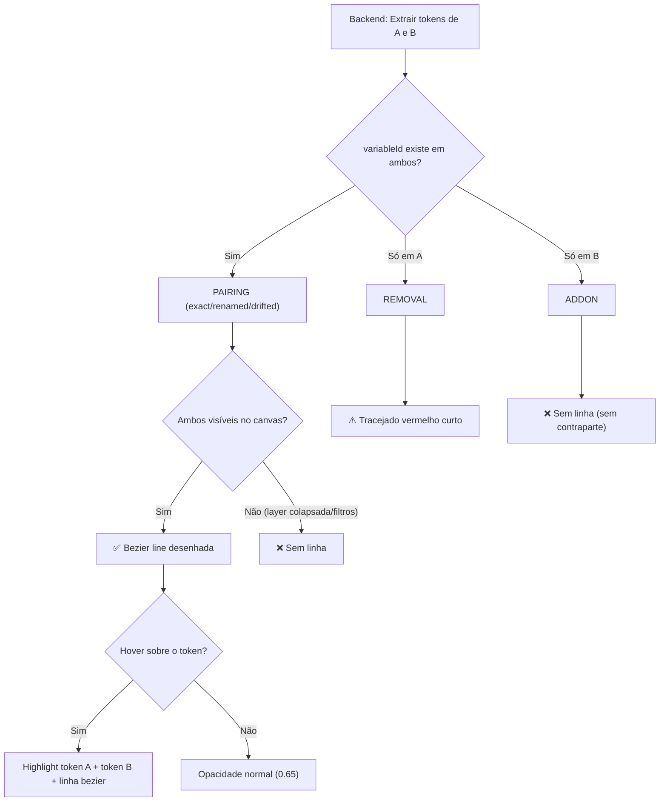

# Lógica das Ligações de Tokens
#mirage #tokens #diff

> [!IMPORTANT]
> **Dois tokens ficam ligados (linha bezier no canvas) se e só se partilham o mesmo `variableId` nos dois componentes (A e B).** Tokens que existem apenas num dos lados não têm ligação.

---

## Como funciona, passo a passo

### 1. Extracção de tokens (Backend — `code.ts`)

Quando fazes **COMPARE** entre dois componentes A e B, o backend percorre a árvore de layers de cada um e extrai todos os tokens (variáveis Figma ligadas via `boundVariables`). Cada token tem uma chave única: o **`variableId`** — o ID interno da variável Figma.

O backend constrói dois mapas:

```
tokensA: Map<variableId → { name, type, resolvedValue }>
tokensB: Map<variableId → { name, type, resolvedValue }>
```

### 2. Classificação por diff (Backend — `code.ts` L315-L330)

O backend compara os dois mapas e cria **3 categorias**:

| Categoria | Condição | Tem linha no canvas? |
|-----------|----------|---------------------|
| **Pairings** (exact / renamed / drifted) | `variableId` existe **em ambos** A e B | ✅ Sim — bezier colorida |
| **Removals** | `variableId` existe **só em A** | ⚠️ Tracejado vermelho curto (não liga a B) |
| **Add-ons** | `variableId` existe **só em B** | ❌ Nenhuma linha |

```javascript
// Lógica simplificada do backend:
for (const [varId, tA] of tokensA) {
  if (tokensB.has(varId)) {
    // → PAIRING (exact, renamed, ou drifted)
    pairings.push(...)
  } else {
    // → REMOVAL (só existe em A)
    removals.push(...)
  }
}
for (const [varId, tB] of tokensB) {
  if (!tokensA.has(varId)) {
    // → ADDON (só existe em B)
    addons.push(...)
  }
}
```

### 3. Desenho das linhas (Frontend — `14-compare-mode.js` L1055-L1101)

No canvas, as linhas só são desenhadas para **pairings**:

```javascript
Object.keys(cmPairingMap).forEach(function (varId) {
  var nodeA = cmLayoutA.tokenNodeMap[varId];  // token visual no lado A
  var nodeB = cmLayoutB.tokenNodeMap[varId];  // token visual no lado B
  if (!nodeA || !nodeB) return;  // ← se um dos lados não tiver o token visível, não desenha linha!

  // Desenhar bezier de nodeA → nodeB
});
```

> [!NOTE]
> Mesmo que um pairing exista (mesmo `variableId` nos dois lados), a **linha só aparece se ambos os tokens estiverem visíveis** no canvas. Se uma layer estiver colapsada, o token fica escondido e a linha desaparece.

### 4. Hover / Highlight (Frontend — `14-compare-mode.js` L1530-L1550)

Quando passas o rato por cima de um token:

1. O sistema guarda o `cmHoveredId` (ID do nó sob o cursor)
2. Procura a **contraparte** no lado oposto:
   - Para **tokens**: procura um nó no outro lado com o **mesmo `variableId`**
   - Para **layers**: procura uma layer no outro lado com o **mesmo nome na mesma profundidade**
3. Se encontrar contraparte → `cmHoveredCounterpartId` é preenchido → **highlight nos dois**
4. Tudo o resto fica **dim** (opacidade ~20%)

```javascript
// Para tokens:
if (hitNode.type === 'token') {
  // Procurar no lado oposto um token com o mesmo variableId
  for (var i = 0; i < otherLayout.nodes.length; i++) {
    if (on.type === 'token' && on.variableId === hitNode.variableId) {
      cmHoveredCounterpartId = on.id;  // ← encontrou!
      break;
    }
  }
}
```

---

## Porque é que nem todos os tokens estão ligados?

Há **4 razões** pelas quais um token pode aparecer sem ligação:

### 1. 🔴 O token é um **Removal** — só existe em A
O componente A usa uma variável Figma que o componente B não usa. Aparece com um tracejado vermelho curto que não liga a lado nenhum.

### 2. 🔵 O token é um **Add-on** — só existe em B
O componente B usa uma variável que A não usa. Aparece sem qualquer linha.

### 3. 📁 A layer do lado oposto está **colapsada**
Mesmo que o `variableId` exista nos dois lados (pairing), se a layer que contém o token no lado oposto estiver colapsada, o token não está no `tokenNodeMap` visual → **a linha não é desenhada**.

### 4. 🔍 Filtros activos removem o token da vista
Se estiveres com filtros de **isolate por kind** (na legenda), filtro de **layer** ou filtro de **token**, tokens que não passem o filtro são excluídos do layout visual e as suas linhas desaparecem.

---

## Diagrama da lógica



---

## Cores das linhas

| Kind | Cor | Significado |
|------|-----|-------------|
| **Exact** | `#22c55e` 🟢 | Mesmo variableId, mesmo nome, mesmo valor |
| **Renamed** | `#eab308` 🟡 | Mesmo variableId, nomes diferentes |
| **Drifted** | `#f97316` 🟠 | Mesmo variableId, mesmo nome, valores diferentes |
| **Removal** | `#ef4444` 🔴 | Só existe em A (tracejado) |
| **Add-on** | `#3b82f6` 🔵 | Só existe em B (sem linha) |
