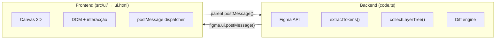
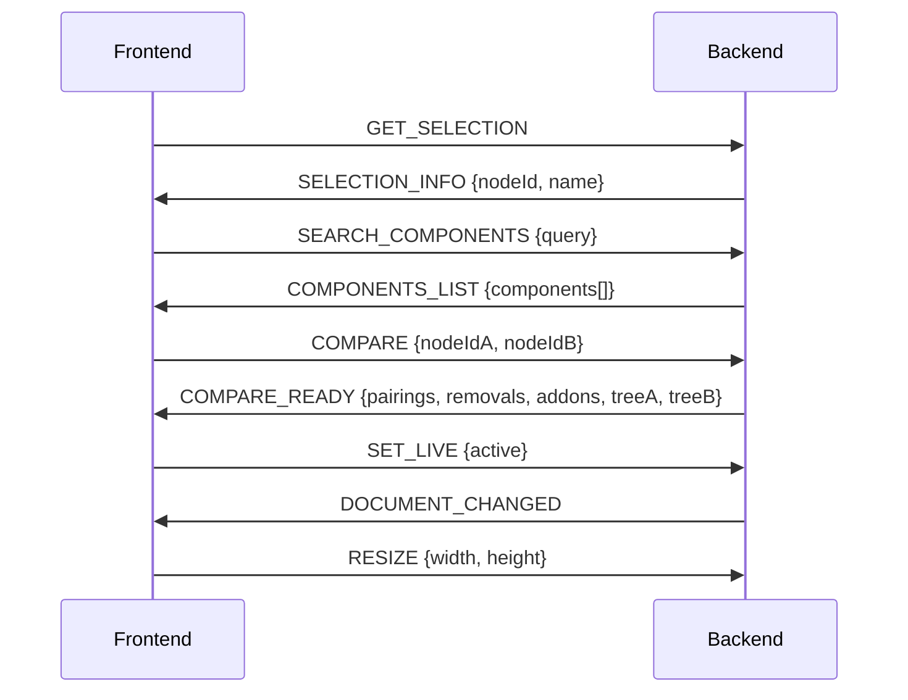

# Arquitectura do TokenMirage
#mirage #arquitectura

> [!IMPORTANT]
> O Figma Plugin usa um modelo de **dois processos isolados** que comunicam exclusivamente via `postMessage`. O backend tem acesso à Figma API; o frontend não.

---

## Como os dois processos comunicam



---

## Backend — `code.ts`

> [!NOTE]
> 344 linhas. Corre na sandbox do Figma com acesso total à API.

### Funções principais

| Função | Responsabilidade |
|--------|------------------|
| `extractTokens(node)` | Lê `boundVariables` de um nó, resolve cada variável para `{ variableId, name, resolvedValue }` |
| `detectHardcoded(node)` | Detecta fills/strokes/opacity/corner **sem** binding (valores hardcoded) |
| `collectLayerTree(node, tokenMap)` | DFS recursivo — constrói árvore de layers filtrando apenas nós com tokens, hardcoded ou broken refs |
| `formatValue(val)` | Resolve valores (cores, aliases) para strings legíveis |

### Handlers de mensagem

| Mensagem recebida | Resposta enviada | O que faz |
|--------------------|------------------|-----------|
| `GET_SELECTION` | `SELECTION_INFO` | Captura selecção actual do utilizador |
| `SEARCH_COMPONENTS` | `COMPONENTS_LIST` | Pesquisa componentes por nome (max 60) |
| `COMPARE` | `COMPARE_READY` | Extrai tokens de A e B, corre diff, devolve `{ pairings, removals, addons, treeA, treeB }` |
| `SET_LIVE` | — | Activa/desactiva monitorização de alterações |
| `RESIZE` | — | Redimensiona janela do plugin |

### Lógica do diff

```typescript
// Para cada variableId em A:
if (tokensB.has(varId)) {
  // Mesmo ID em ambos → PAIRING
  if (nomeA !== nomeB)          kind = 'renamed'
  else if (valorA !== valorB)   kind = 'drifted'
  else                          kind = 'exact'
} else {
  // Só em A → REMOVAL
}

// Para cada variableId em B que não está em A:
// → ADDON
```

---

## Frontend — `src/ui/`

> [!NOTE]
> Corre numa iframe sandboxed **sem acesso à Figma API**. Toda a comunicação passa por `postMessage`.

### Build system

O script `scripts/build-ui.js` concatena CSS + JS em `modelo.html` → `ui.html`. Sem bundler, sem transpilação. O Figma exige um **único ficheiro HTML**.

### Ficheiros JS (por ordem de carregamento)

| Ficheiro | Linhas | O que faz | Essencial? |
|----------|--------|-----------|------------|
| `01-estado-global.js` | 37 | Variáveis globais: `compareSlotA/B`, `comparePendingSlot`, `compareResult` | ⚠️ Parcial — contém código morto |
| `02-utilidades.js` | 105 | Helpers: `escHtml()` | ⚠️ Parcial — 4 de 5 funções são dead code |
| `04-comunicacao-figma.js` | 49 | `post()` + dispatcher `window.onmessage` | ✅ Essencial |
| `12-controlos-interface.js` | 19 | `showView()` | ❌ Dead code — nunca chamada |
| `14-compare-mode.js` | **1931** | **Toda a lógica do compare mode** | ✅ Essencial (70.5% do ui.html) |
| `13-inicializacao.js` | 13 | Chama `initCompareMode()` | ✅ Essencial |

> [!WARNING]
> Ver [[codigo-morto]] para lista completa do código não utilizado.

### Ficheiros CSS

| Ficheiro | Linhas | O que faz |
|----------|--------|-----------|
| `variaveis-tema.css` | 74 | CSS vars (tema Catppuccin Mocha), reset, body |
| `compare-mode.css` | 712 | Todos os estilos do compare mode |

### HTML

`modelo.html` (95 linhas) — template com marcadores `/* CSS:START */` e `/* JS:START */` onde o build injecta o conteúdo.

---

## Protocolo de mensagens



---

## Convenções de código

| Convenção | Exemplo |
|-----------|---------|
| Globals com prefixo `cm*` | `cmCanvas`, `cmHoveredId`, `cmScrollY` |
| Funções privadas com `_cm*` | `_cmHoverTimer`, `_cmExpandAll()` |
| Constantes de layout no objecto `CMR` | `CMR.pad`, `CMR.lw`, `CMR.th` |
| Cores por kind no objecto `CM_COLORS` | `CM_COLORS.exact`, `CM_COLORS.removal` |
