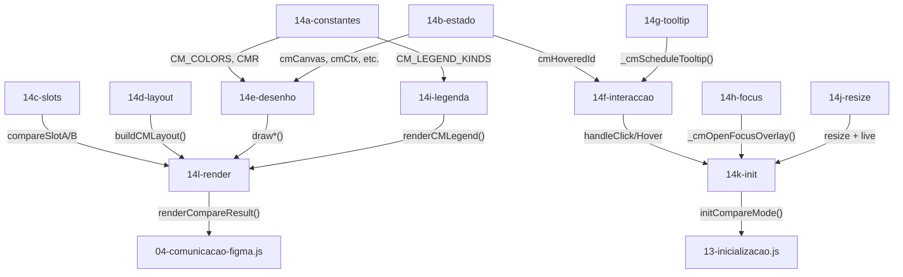

# Plano de Refactoring
#mirage #refactoring

> [!IMPORTANT]
> O `ui.html` tem **~106 KB** e **3049 linhas**. Um único ficheiro (`14-compare-mode.js`) concentra **70.5%** do peso total com **1931 linhas** e **~11 responsabilidades** misturadas.

---

## O problema em números

```
14-compare-mode.js ███████████████████████████████████ 70.5%  (74.7 KB)
compare-mode.css   ████████                           15.4%  (16.3 KB)
modelo.html        ██                                  3.9%   (4.2 KB)
02-utilidades.js   ██                                  3.5%   (3.8 KB)
variaveis-tema.css █                                   1.9%   (2.1 KB)
04-comunicacao.js  █                                   1.4%   (1.5 KB)
01-estado-global   █                                   1.2%   (1.3 KB)
12-controlos.js    ▌                                   0.6%   (0.7 KB)
13-inicializacao   ▌                                   0.4%   (0.5 KB)
```

---

## Proposta: Dividir `14-compare-mode.js` em módulos

### Novos ficheiros

| Ficheiro | Responsabilidade | Linhas est. |
|----------|-----------------|-------------|
| `14a-cm-constantes.js` | `CM_COLORS`, `CMR`, `CM_LEGEND_KINDS` | ~50 |
| `14b-cm-estado.js` | Variáveis de estado do canvas (`cmCanvas`, `cmScrollY`, etc.) | ~50 |
| `14c-cm-slots.js` | Autocomplete, selecção de slots, swap, clear, empty state | ~250 |
| `14d-cm-layout.js` | `buildCMLayout()` + filtros + helpers de layout | ~250 |
| `14e-cm-desenho.js` | `redrawCompareCanvas()` + todas as funções `draw*` | ~350 |
| `14f-cm-interaccao.js` | Click, hover, hit-test, collapse, counterpart | ~250 |
| `14g-cm-tooltip.js` | Tooltip de token, hardcoded, broken + copy utility | ~200 |
| `14h-cm-focus.js` | Focus overlay (double-click) | ~120 |
| `14i-cm-legenda.js` | Legenda interactiva + isolate | ~80 |
| `14j-cm-resize.js` | Resize handles + live refresh | ~80 |
| `14k-cm-init.js` | `initCompareMode()`, `initCompareCanvas()`, event listeners | ~100 |
| `14l-cm-render.js` | `renderCompareResult()`, `_rebuildAndDraw()` | ~80 |

> [!NOTE]
> Esta divisão **não altera o output** — o build system concatena tudo, portanto o `ui.html` final fica exactamente igual. A mudança é 100% organizacional.

### Mapa de dependências



### Como implementar

1. Extrair secções na ordem da tabela (variáveis são globais — sem conflito de scope)
2. Actualizar o array `JS_FILES` em `scripts/build-ui.js`
3. A ordem no array garante que variáveis são definidas antes de serem usadas
4. `npm run build` e testar no Figma

---
## Outras melhorias possíveis

### Curto prazo (sem risco)

- [ ] **Remover redundância** — O objecto `export const CM_COLORS` (lado A) ou similares
- [ ] **Remover código morto** — ver [[codigo-morto]] (~1.8 KB, ~60 linhas)
- [ ] **Remover block comments** — Os sumários grandes no topo dos ficheiros

### Médio prazo

- [ ] **Minificar no build** — adicionar `terser` (JS) + `cssnano` (CSS) em `build-ui.js` → redução de ~40-50% (~106 → ~60 KB)
- [ ] **Unificar ficheiros pequenos** — `01-estado-global.js` + `02-utilidades.js` + `13-inicializacao.js` → um só `00-core.js` (~60 linhas)

### Longo prazo (mais disruptivo)

- [ ] **Migrar frontend para TypeScript** — type-safety para todo o projecto
- [ ] **Bundler leve** — `esbuild` (zero-config) bundlaria + minificaria automaticamente

---

## Estimativa de impacto

| Acção | Redução estimada |
|-------|-----------------|
| Remover código morto | ~1.8 KB |
| Dividir `14-compare-mode.js` | 0 KB (organização) |
| Remover comentários redundantes | ~5-8 KB |
| Minificar JS + CSS no build | ~40-45 KB |
| **Total com minificação** | **~55-60 KB** (redução de ~45%) |
